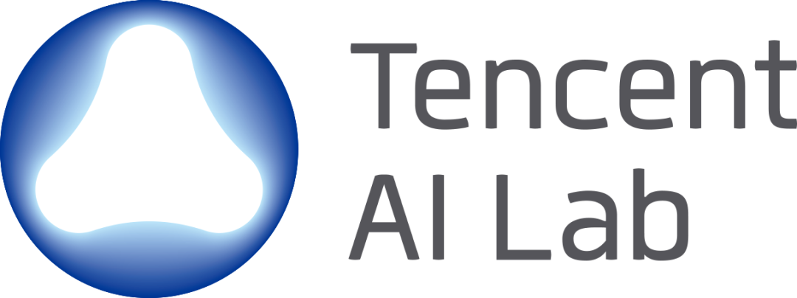

<section class="home-hero home-hero--refined">
  

    
Computer Vision · Computer Graphics · Generative AI

    <nav class="home-actions" aria-label="Research profiles">
      <a class="home-action primary" href="{{ '/publications/' | relative_url }}">Publications</a>
      <a class="home-action" href="https://scholar.google.com/citations?user=bLRjUzAAAAAJ&amp;hl=zh-CN" target="_blank" rel="noopener noreferrer">Google Scholar</a>
      <a class="home-action" href="https://github.com/KumapowerLIU" target="_blank" rel="noopener noreferrer">GitHub</a>
    </nav>
  

  <aside class="home-focus-card">
    
Current Focus

    <ul>
      <li>Video generation and generative world models</li>
      <li>Human-centered multimodal spatial intelligence and digital avatars</li>
      <li>Image generation and editing</li>
    </ul>
  </aside>
</section>

<section class="home-bio-card home-bio--refined">
  

    I am a Ph.D. student in Computer Science and Engineering at
    <a href="https://hkust.edu.hk/" target="_blank" rel="noopener noreferrer">HKUST</a>,
    advised by <a href="https://cqf.io/" target="_blank" rel="noopener noreferrer">Prof. Qifeng Chen</a>.
  

  

    My research spans <strong>video generation and generative world models</strong>,
    <strong>human-centered multimodal spatial intelligence</strong>, and <strong>image generation and editing</strong>.
    I currently focus on post-training world models and embodied intelligence.
  

  

    Outside the lab, I love fishing and hope to explore China’s rivers, lakes, and coastlines, one fishing trip at a time.
  

</section>

<section class="home-affiliations">
  
Experience & Affiliations

  

    
    
    
    
    
    
    
    
  

</section>
